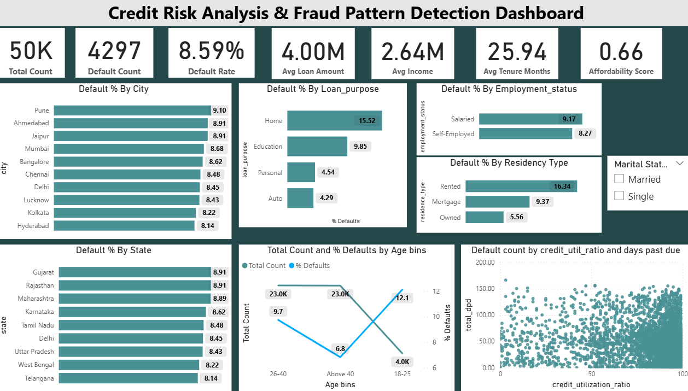

  

# 💳 Risk Radar - Credit Risk Modelling
### App Link: [RiskRadar - Live Credit Scoring Engine](https://riskradar.onrender.com)

---

## 🔍 Business Problem:
Money Lending instituitions often struggle to identify which applicants might default on loans. This leads to financial losses and operational risks. The goal is to build a solution that accurately classifies applicants based on their creditworthiness, making the loan approval process more efficient and secure.

---

## Overview:
A powerful, production-ready Credit Risk Scoring System built for financial institutions. Mimicking a CIBIL-like credit scorecard. It classifies applicants into different risk bands using financial and behavioral indicators. Designed to support smarter, faster lending decisions while reducing default risk, this real-time system is fair, scalable, and data-driven.

---

## Demo video
https://github.com/user-attachments/assets/4bb24da3-ff39-4984-b5cd-980bcc0c37d5

---

## Power BI Dashboard:

**Power Bi Dashboard for analyzing default patterns.**

---

## 📌 Technical Details:

### Data Preprocessing
- Prevented data leakage by separating features (`X`) and target (`y`) early.
- Applied various transformation steps like outlier handling, imputing the missing values on both train and test sets.

### Exploratory Data Analysis
- Used histograms and KDE plots to visualize key predictors.
- Explored risk segments across demographics.

### Feature Engineering
- Created 3 meaningful features namely `Loan-to-Income Ratio`, `Delinquency Ratio`, and `Avg Days Past Due`.

### Feature Selection
- For Numerical columns we used **Variance Inflation Factor** .
- For Categorical features used **Weight of Evidence & Information value** for business relevance.

### 🤖 Model Development
- Trained Logistic Regression, Random Forest, and XGBoost.
- Used SMOTE-Tomek Links to balance default vs non-default classes.
- Finalized logistic regression model with smote tomek links for handling class imbalance efficiently.

### 🛠️ Hyperparameter Tuning
- Tried fine tuning using randomized search cv 
- finalized and fine tuned the model using **optuna** library which uses an efficent approach rather than random combinations which randomized search cv uses.

---

## 📈 Evaluation Metrics
- **Accuracy:** 0.93 
- **Recall on default class (1):** 0.94 
- **ROC AUC:** 0.983  
- **KS Statistic:** 85 (top 3 deciles). Model is able to catch 85% of default cases in first 3 deciles itself.  

---

# Key Insights:
**Important: In the Context of Credit Risk Modelling and loan defaults, default refers to when the person is unable to pay the loan**

## 1. Default % By Age Bins:

**The Age Group 18-25 have higher default rate (12%) followed By 26-40 (9.7 %) and above 40 (6.8 %)**
**Younger age groups are more prone to default than the elder ones.**

## 2. Default % By City:

**This Bar chart illustrates default% by each city.**
**Pune has the highest no of defaults (9.1%) whereas hyderabad has least defaults (8.2%).**

## 3. Default% By Loan Purpose:

**Majority of the defaults were caused by home loans (15%), Education loans contributed to (9.9%) of defaults.**
**Personal and auto type of loans did not default much (4 to 5 %).**

## 4. Relationship between credit utilization ratio and DPD affecting Default:

**The above scatter chart shows the relationship of credit utilization ratio and total days past due with size set to default %.**
**Higher the credit utilization ratio and days past due more chance of it to default.**

## 5. Default % by residency type and employment status:

**Individuals with rented residency tend to default more (16%).**
**People who have mortgage on their homes contribute to 9.4 % default and professionals who own their homes have very less default rate 5.5 %.**
**Salaried professionals defaulted slightly more (9.1) as compared to self-employed professionals**

## 6. Roc, Auc Curve:

## 7. Feature Importances:

**The most essential features affecting model performance are credit utilization ratio, loan to income ratio, delinquency ratio, avg days past due per delinquncy.**

--- 

## ⚙️ Tech Stack:
- Python (3.10+)
- Pandas, Numpy, Matplotlib, Seaborn
- FastAPI (for scoring backend)
- Streamlit (UI)
- Optuna (Hyperparameter tuning)
- SMOTE-Tomek (Class imbalance handling)
- Render (deployment)

---

## 📌 Top Conclusions:

- Factors like Loan-to-Income Ratio and Delinquency Ratio are strong indicators of risk.
- A High recall for defaults helps in identifying risky borrowers early, improving risk management
- Classifying borrowers early based on their risk level helps lenders manage loans more safely.