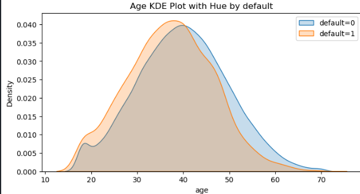
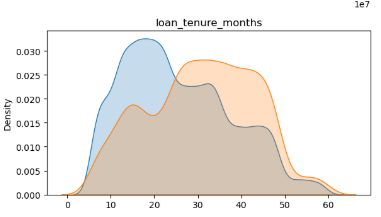
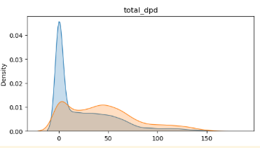
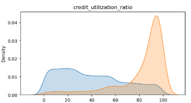
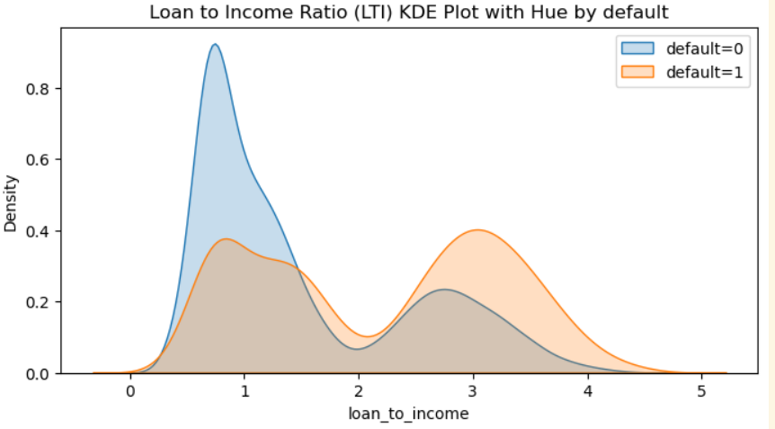

  
Banner [source](https://banner.godori.dev/)

# 💳 Credit Risk Modelling

**App Link:** [RiskRadar - Live Credit Scoring Engine](https://riskradar.onrender.com)
---

## Overview:
A powerful, production-ready Credit Risk Scoring System built for financial institutions. Mimicking a CIBIL-like credit scorecard. It classifies applicants into different risk bands using financial and behavioral indicators. Designed to support smarter, faster lending decisions while reducing default risk, this real-time system is fair, scalable, and data-driven.

---

## 🔍 Business Problem:
Loan default is a critical challenge for lending institutions. This app predicts an applicant’s credit risk by classifying them into bands like *Poor*, *Average*, *Good*, and *Excellent*, Empowering institutions with smarter lending decisions.

---

## Key Insights:

### 1. Age Column

**Average age in the default group is little less (37.12) than the average (39.7) of the group that did not default**
**Orange (defaulted) group is slightly shifted to left indicating that younger folks are more likely to default on their loanst**

### 2.KDE Plots:

**In columns: loan_tenure_months, delinquent_months, total_dpd, credit_utilization, higher values indicate high likelyhood of becoming a default. Hence these 4 looks like strong predictors**

### 3. Roc, Auc Curve:

**False positive rate vs True positive rate, Area under the curve = 0.98**

### 4. Feature Importances:

**All the three ratios indicate as Important feature for the model**

--- 

## ⚙️ Tech Stack:
- Python (3.10+)
- Pandas, Numpy, Matplotlib, Seaborn
- FastAPI (for scoring backend)
- Streamlit (UI for predictions)
- Optuna (Hyperparameter tuning)
- SMOTE-Tomek (Class imbalance handling)

---

## 🧪 Methods:

### 📥 Data Preprocessing
- Prevented data leakage by separating features (`X`) and target (`y`) early.
- Applied identical pipelines to train/test sets independently.

### 📊 Exploratory Data Analysis
- Used histograms and KDE plots to visualize key predictors.
- Explored risk segments across demographics.

### 🧠 Feature Engineering
- Created meaningful features like `Loan-to-Income Ratio`, `Delinquency Ratios`, and `Avg Days Past Due`.
- Applied domain expertise for better interpretability.

### 🧮 Feature Selection
- Checked multicollinearity with VIF.
- Evaluated categorical features using WoE & IV for business relevance.

### 🤖 Model Development
- Trained Logistic Regression, Random Forest, and XGBoost.
- Used SMOTE-Tomek Links to balance default vs non-default classes.

### 🛠️ Hyperparameter Tuning
- Fine-tuned models using Optuna to reduce false negatives and improve recall.

---

## 📈 Evaluation Metrics
- **ROC AUC:** 0.983  
- **KS Statistic:** 85 (top 3 deciles)  
- **Gini Coefficient:** High discriminatory power  
- **Decile Analysis:** Effective risk segmentation

---

## 📌 Key Findings:
- Features like `Loan-to-Income Ratio` and `Delinquency Ratios` are strong predictors.
- High recall in default class improves proactive risk control.
- Risk band classification helps in better credit policy alignment.

---

> 🚀 **The final model deployed is a Logistic Regression classifier with custom SMOTE handling, served through FastAPI and visualized via Streamlit.**
