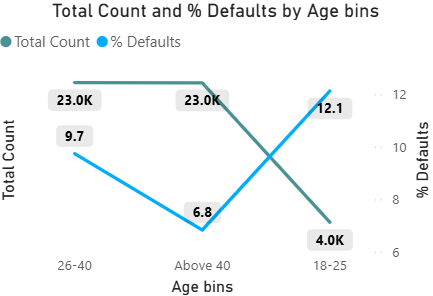

  
Banner [source](https://banner.godori.dev/)

# 💳 Credit Risk Modelling

##### App Link: [RiskRadar - Live Credit Scoring Engine](https://riskradar.onrender.com)

---

## 🔍 Business Problem:
Money Lending instituitions often struggle to identify which applicants might default on loans. This leads to financial losses and operational risks. The goal is to build a solution that accurately classifies applicants based on their creditworthiness, making the loan approval process more efficient and secure.

---

## Overview:
A powerful, production-ready Credit Risk Scoring System built for financial institutions. Mimicking a CIBIL-like credit scorecard. It classifies applicants into different risk bands using financial and behavioral indicators. Designed to support smarter, faster lending decisions while reducing default risk, this real-time system is fair, scalable, and data-driven.

---

## Power BI Dashboard:

**Power Bi Dashboard for analyzing default patterns.**

---

# Key Insights:
**Important: In the Context of Credit Risk Modelling and loan defaults, default refers to when the person is unable to pay the loan**

## 1. Default % By Age Bins:

**The Age Group 18-25 have higher default rate (12%) followed By 26-40 (9.7 %) and above 40 (6.8 %)**
**Younger age groups are more prone to default than the elder ones.**

## 2. Default % By City:

**This Bar chart illustrates default% by each city.**
**Pune has the highest no of defaults (9.1%) whereas hyderabad has least defaults (8.2%).**

## 3. Default% By Loan Purpose:

**Majority of the defaults were caused by home loans (15%), Education loans contributed to (9.9%) of defaults.**
**Personal and auto type of loans did not default much (4 to 5 %).**

## 4. Relationship between credit utilization ratio and DPD affecting Default:

**The above scatter chart shows the relationship of credit utilization ratio and total days past due with size set to default %.**
**Higher the credit utilization ratio and days past due more chance of it to default.**

## 5. Default % by residency type and employment status:

**Salaried professionals defaulted slightly more (9.1) as compared to self-employed professionals**
**Individuals with rented residency tend to default more (16%).**
**People who have mortgage on their homes contribute to 9.4 % default and professionals who own their homes have very less default rate 5.5 %.**

## 6. Roc, Auc Curve:

**False positive rate vs True positive rate, Area under the curve = 0.98**

## 7. Feature Importances:

--- 

## ⚙️ Tech Stack:
- Python (3.10+)
- Pandas, Numpy, Matplotlib, Seaborn
- FastAPI (for scoring backend)
- Streamlit (UI)
- Optuna (Hyperparameter tuning)
- SMOTE-Tomek (Class imbalance handling)
- Render (deployment)

---

## 🧪 Methods:

### 📥 Data Preprocessing
- Prevented data leakage by separating features (`X`) and target (`y`) early.
- Applied identical pipelines to train/test sets independently.

### 📊 Exploratory Data Analysis
- Used histograms and KDE plots to visualize key predictors.
- Explored risk segments across demographics.

### 🧠 Feature Engineering
- Created meaningful features like `Loan-to-Income Ratio`, `Delinquency Ratios`, and `Avg Days Past Due`.
- Applied domain expertise for better interpretability.

### 🧮 Feature Selection
- Checked multicollinearity with VIF.
- Evaluated categorical features using WoE & IV for business relevance.

### 🤖 Model Development
- Trained Logistic Regression, Random Forest, and XGBoost.
- Used SMOTE-Tomek Links to balance default vs non-default classes.

### 🛠️ Hyperparameter Tuning
- Fine-tuned models using Optuna to reduce false negatives and improve recall.

---

## 📈 Evaluation Metrics
- **ROC AUC:** 0.983  
- **KS Statistic:** 85 (top 3 deciles)  
- **Gini Coefficient:** High discriminatory power  
- **Decile Analysis:** Effective risk segmentation

---

## 📌 Key Findings:
- Features like `Loan-to-Income Ratio` and `Delinquency Ratios` are strong predictors.
- High recall in default class improves proactive risk control.
- Risk band classification helps in better credit policy alignment.

---

> 🚀 **The final model deployed is a Logistic Regression classifier with custom SMOTE handling, served through FastAPI and visualized via Streamlit.**
